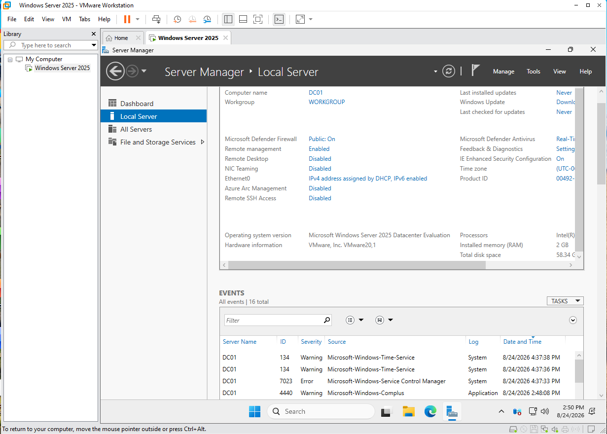
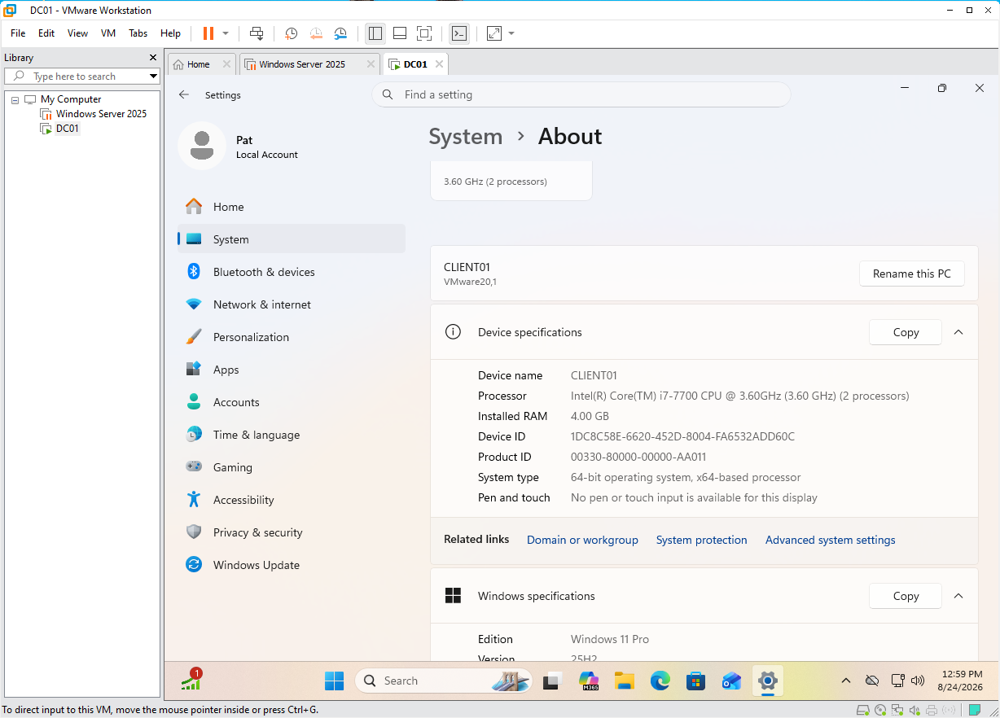
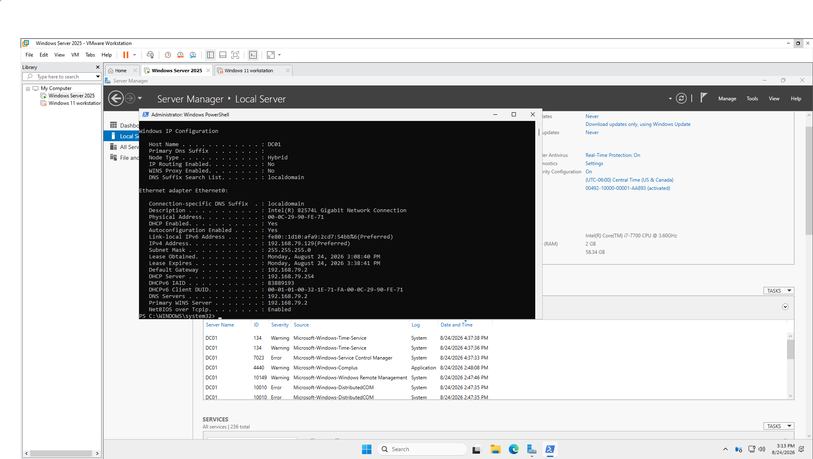
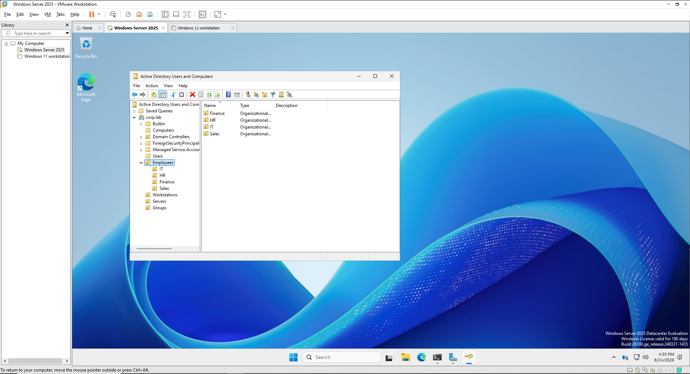
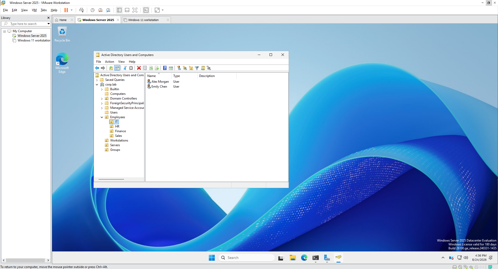
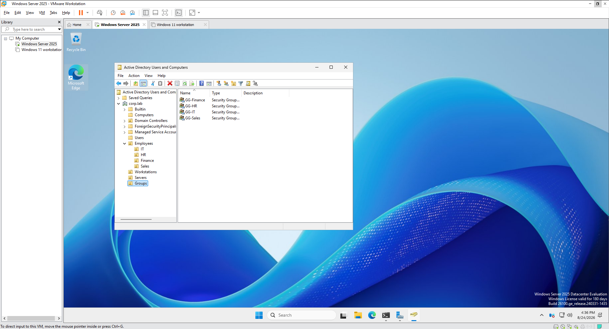
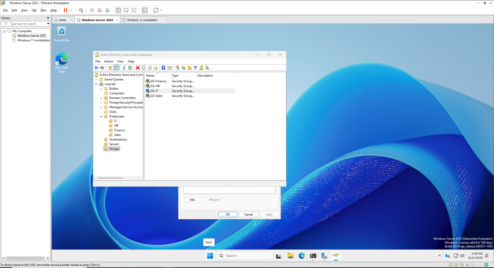
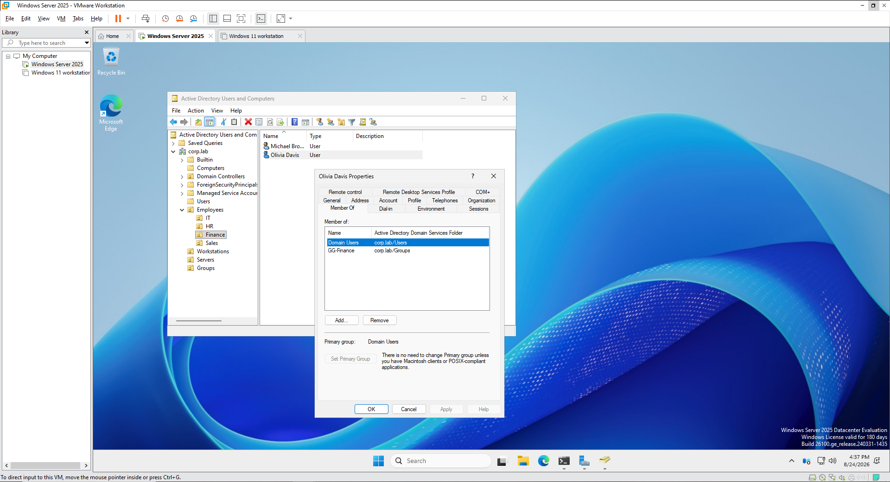
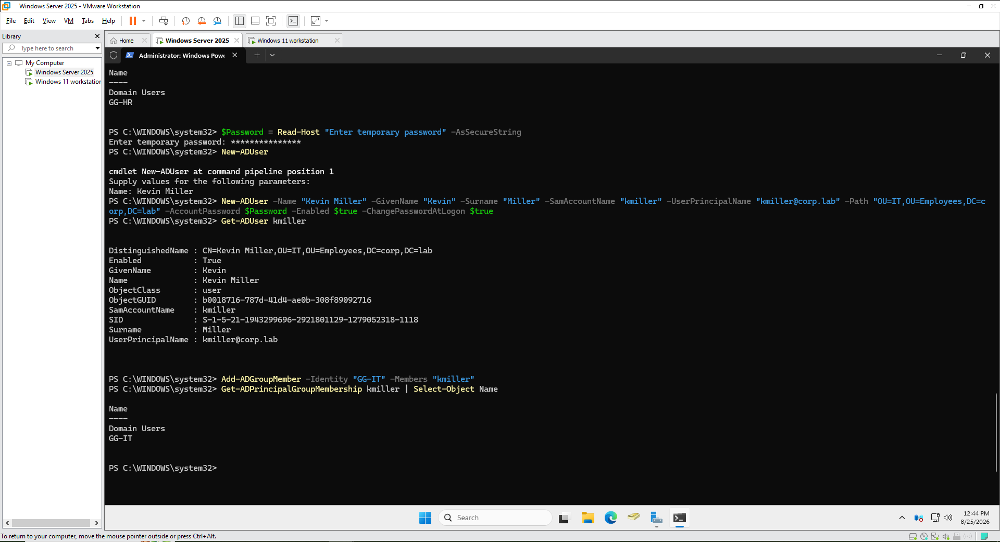
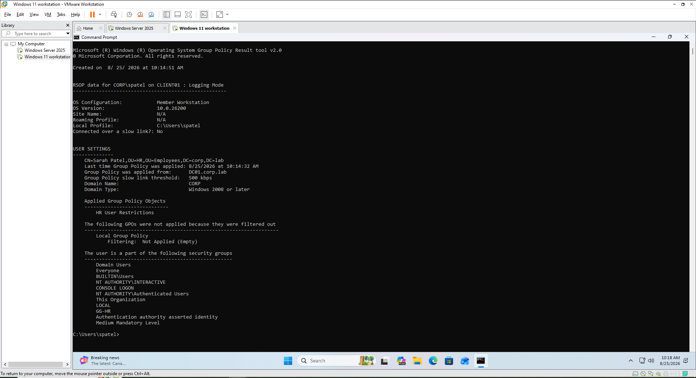

# Enterprise Help Desk & ITSM Lab

## Overview

This project simulates a small enterprise IT environment used to practice help desk administration, Active Directory management, Group Policy, network troubleshooting, and IT ticket management.

The environment consists of a Windows Server domain controller, a domain-joined Windows 11 workstation, and an Ubuntu Server hosting osTicket.

## Lab Architecture

- DC01 - Windows Server 2025
  - Active Directory Domain Services
  - DNS
  - Organizational Units
  - Users and Groups
  - Group Policy

- CLIENT01 - Windows 11
  - Domain-joined workstation
  - Employee endpoint
  - Group Policy testing

- HELPDESK01 - Ubuntu Server 24.04 LTS
  - Apache
  - PHP
  - MariaDB
  - osTicket

## Technologies Used

- VMware Workstation
- Windows Server 2025
- Windows 11
- Ubuntu Server 24.04 LTS
- Active Directory Domain Services
- DNS
- Group Policy
- PowerShell
- osTicket
- Apache
- PHP
- MariaDB

## Infrastructure

### Windows Server Domain Controller

DC01 was configured as the Windows Server domain controller for the lab environment.

### Windows 11 Workstation

CLIENT01 was configured as the employee workstation used for domain authentication, Group Policy testing, and help desk troubleshooting.

### Network Configuration

Verified the network configuration of DC01 and its connectivity within the VMware lab environment.

## Active Directory Configuration

Created a simulated corporate Active Directory environment using the `corp.lab` domain.

Configured organizational units for users, workstations, servers, and departmental resources.

### Organizational Unit Structure

Created departmental organizational units for IT, HR, Finance, and Sales, along with separate OUs for workstations, servers, and security groups.

## User and Group Administration

Created employee accounts and department-based security groups to simulate identity and access management in a corporate environment.

Created security groups for each department.

Verified security group membership.

Verified individual user group membership.

## PowerShell User Provisioning

Used PowerShell to create Active Directory users, configure account properties, place users in the correct organizational unit, and assign security group membership.

## Group Policy

Configured Group Policy Objects to manage domain users and workstation settings.

Verified the HR user restriction policy was successfully applied to CLIENT01 using Group Policy Results.

## ITSM / Ticketing

Installed and configured osTicket on Ubuntu Server to simulate a centralized enterprise help desk ticketing system.

Tickets are categorized by help topic, assigned to technicians, documented during troubleshooting, and closed after resolution.

osTicket screenshots and ticket workflow examples will be added after completing the ticketing scenarios.

## Ticket Scenarios

### Password Reset

User reported being unable to authenticate to the Windows domain.

Actions performed:
- Verified the user account in Active Directory
- Reset the user's password
- Required password change at next logon
- Documented the resolution in osTicket
- Closed the ticket

### Account Lockout

User account became locked after repeated failed login attempts.

Actions performed:
- Verified account status
- Unlocked the user account
- Confirmed authentication
- Documented and closed the incident

### New User Onboarding

Created a new Active Directory account and assigned the user to the appropriate organizational unit and security groups.

### Access Request

Reviewed group membership and granted appropriate department access.

### Network Connectivity

Diagnosed workstation connectivity using IP and DNS troubleshooting and verified communication with internal domain resources.

## Skills Demonstrated

- Help desk ticket management
- Incident documentation
- Active Directory administration
- User account management
- Password resets and account unlocks
- Organizational Unit management
- Security group management
- Group Policy configuration
- PowerShell administration
- Windows troubleshooting
- DNS troubleshooting
- Client-server architecture
- Linux server administration
- IT service management workflows
