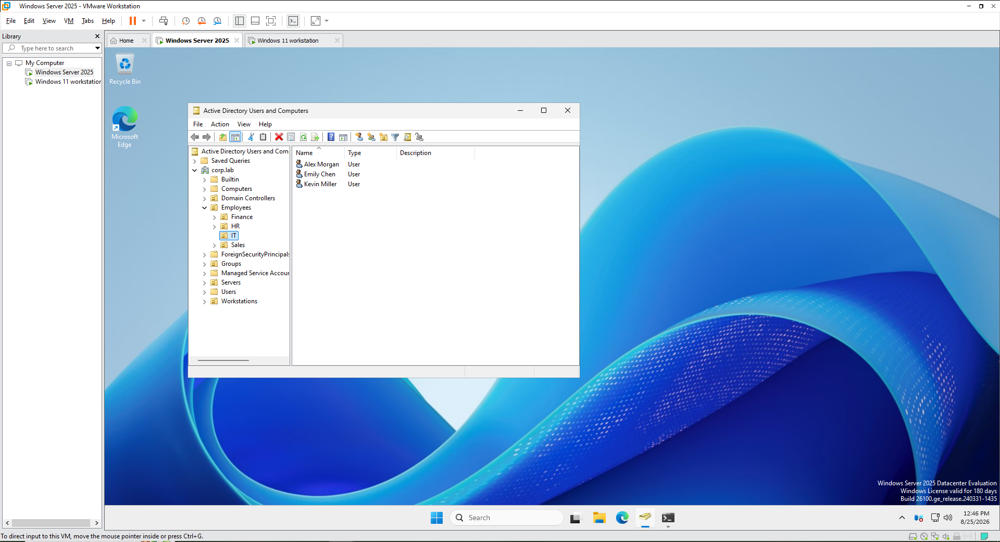

# Enterprise Help Desk & ITSM Lab

## Overview

This project simulates a small enterprise IT environment used to practice
help desk administration, Active Directory management, Group Policy,
network troubleshooting, and IT ticket management.

The environment consists of a Windows Server domain controller, a
domain joined Windows 11 workstation, and an Ubuntu Server hosting
osTicket.

## Lab Architecture

- DC01 - Windows Server 2025
  - Active Directory Domain Services
  - DNS
  - Organizational Units
  - Users and Groups
  - Group Policy

- CLIENT01 - Windows 11
  - Domain-joined workstation
  - Employee endpoint
  - Group Policy testing

- HELPDESK01 - Ubuntu Server 24.04 LTS
  - Apache
  - PHP
  - MariaDB
  - osTicket

## Technologies Used

- VMware Workstation
- Windows Server 2025
- Windows 11
- Ubuntu Server 24.04 LTS
- Active Directory Domain Services
- DNS
- Group Policy
- PowerShell
- osTicket
- Apache
- PHP
- MariaDB

## Active Directory Configuration

Created a simulated corporate Active Directory environment using the
corp.lab domain.

Configured organizational units for users and workstations and created
test employee accounts for help desk scenarios.

## Group Policy

Configured Group Policy Objects to manage domain-joined workstations
and user settings.

Tested policy application on CLIENT01.

## ITSM / Ticketing

Installed and configured osTicket on Ubuntu Server to simulate a
centralized enterprise help desk ticketing system.

Tickets were categorized by help topic, assigned to technicians,
documented during troubleshooting, and closed after resolution.

## Ticket Scenarios

### Password Reset

User reported being unable to authenticate to the Windows domain.

Actions performed:
- Verified the user account in Active Directory
- Reset the user's password
- Required password change at next logon
- Documented the resolution in osTicket
- Closed the ticket

### Account Lockout

User account became locked after repeated failed login attempts.

Actions performed:
- Verified account status
- Unlocked the user account
- Confirmed authentication
- Documented and closed the incident

### New User Onboarding

Created a new Active Directory account and assigned the user to the
appropriate organizational unit and security groups.

### Access Request

Reviewed group membership and granted appropriate department access.

### Network Connectivity

Diagnosed workstation connectivity using IP and DNS troubleshooting and
verified communication with internal domain resources.

## Skills Demonstrated

- Help desk ticket management
- Incident documentation
- Active Directory administration
- User account management
- Password resets and account unlocks
- Organizational Unit management
- Security group management
- Group Policy configuration
- Windows troubleshooting
- DNS troubleshooting
- Client-server architecture
- Linux server administration
- IT service management workflows
