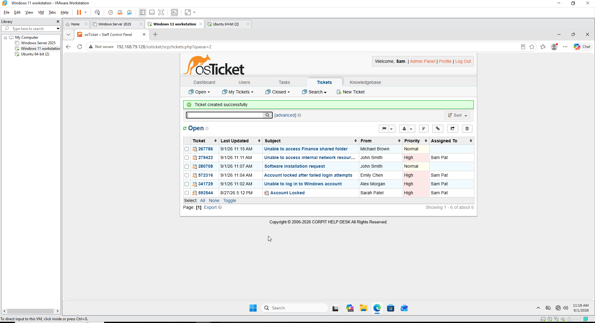
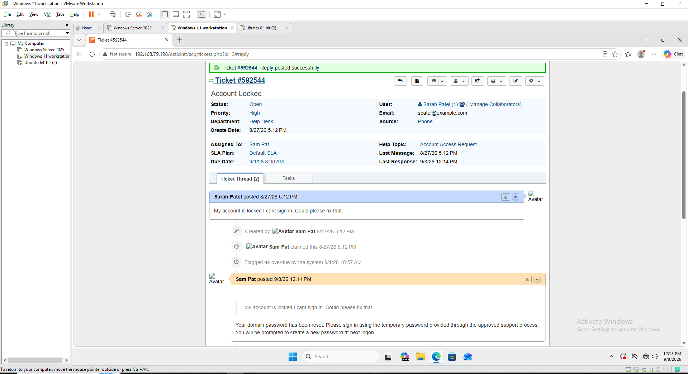
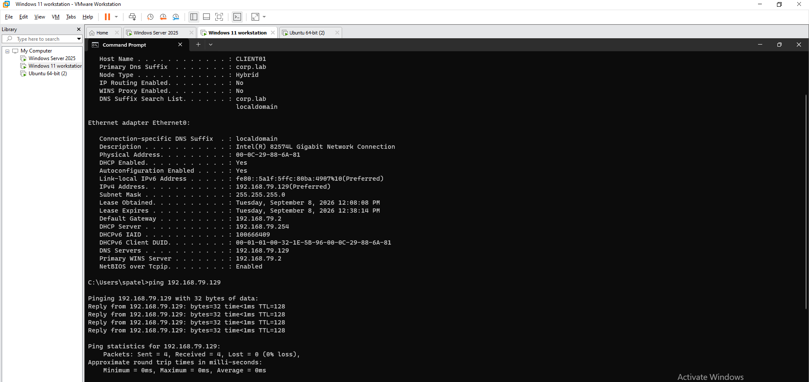

# Enterprise Help Desk & ITSM Lab

## Overview

This project simulates a small enterprise IT environment used to practice help desk administration, Active Directory management, Group Policy, PowerShell administration, network troubleshooting, and IT ticket management.

The environment consists of a Windows Server domain controller, a domain-joined Windows 11 workstation, and an Ubuntu Server hosting osTicket.

The lab was designed to simulate common Tier 1 IT support and system administration tasks in a controlled virtual environment.

## Lab Architecture

- DC01 - Windows Server 2025
  - Active Directory Domain Services
  - DNS
  - Organizational Units
  - Users and Groups
  - Group Policy

- CLIENT01 - Windows 11
  - Domain-joined workstation
  - Employee endpoint
  - Group Policy testing
  - Network troubleshooting

- HELPDESK01 - Ubuntu Server 24.04 LTS
  - Apache
  - PHP
  - MariaDB
  - osTicket

## Technologies Used

- VMware Workstation
- Windows Server 2025
- Windows 11
- Ubuntu Server 24.04 LTS
- Active Directory Domain Services
- DNS
- Group Policy
- PowerShell
- osTicket
- Apache
- PHP
- MariaDB

## Infrastructure

### Windows Server Domain Controller

DC01 was configured as the Windows Server domain controller for the lab environment.

The server provides centralized identity management, DNS, Group Policy, and other domain services for the `corp.lab` environment.

### Windows 11 Workstation

CLIENT01 was configured as the employee workstation and joined to the `corp.lab` domain.

The workstation was used for domain authentication, Group Policy testing, and help desk troubleshooting.

### Network Configuration

Verified the network configuration of DC01 and its connectivity within the VMware lab environment.

## Active Directory Configuration

Created a simulated corporate Active Directory environment using the `corp.lab` domain.

Configured organizational units for users, workstations, servers, security groups, and departmental resources.

### Organizational Unit Structure

Created departmental organizational units for:

- IT
- HR
- Finance
- Sales

Separate organizational units were also used for workstations, servers, and security groups.

## User and Group Administration

Created employee accounts and department-based security groups to simulate identity and access management in a corporate environment.

Created security groups for each department to manage department-based access.

Verified security group membership to confirm users were assigned to the appropriate groups.

Verified individual user group membership.

## PowerShell User Provisioning

Used PowerShell to perform Active Directory administration tasks.

Tasks included:

- Creating Active Directory user accounts
- Configuring user account properties
- Placing users in the appropriate Organizational Units
- Enabling user accounts
- Assigning users to security groups
- Verifying account and group membership

## Group Policy

Configured Group Policy Objects to centrally manage domain users and workstation settings.

Created and tested user restrictions within the lab environment.

Verified that the HR user restriction policy was successfully applied to CLIENT01 using Group Policy Results.

## ITSM / Ticketing

Installed and configured osTicket on Ubuntu Server to simulate a centralized enterprise help desk ticketing system.

The osTicket server uses:

- Ubuntu Server 24.04 LTS
- Apache
- PHP
- MariaDB
- osTicket

Created multiple help desk tickets representing common Tier 1 support requests, including:

- Password and login issues
- Account lockouts
- Department resource access
- Software installation requests
- Network connectivity issues

Tickets were categorized by priority, assigned to a technician, and documented throughout the support workflow.

### Ticket Queue

Created and managed multiple support requests through the osTicket Agent Panel.

The ticket queue was used to track open incidents, priorities, assignments, users, and ticket subjects.

### Ticket Resolution and User Communication

Used osTicket to review reported issues, document support actions, communicate resolution information to users, and manage incidents through the help desk workflow.

## Ticket Scenarios

### Password Reset / Account Access

Simulated common Windows domain authentication and account access requests.

Actions included:

- Reviewing the reported login issue
- Verifying the user account in Active Directory
- Performing password and account administration
- Requiring a password change when appropriate
- Documenting technician actions
- Communicating resolution information through osTicket

### Account Lockout

Simulated an account lockout incident caused by failed authentication attempts.

Actions included:

- Reviewing the user's account status
- Performing Active Directory account administration
- Restoring account access
- Documenting the support process in the ticketing system

### User Provisioning and Access Management

Simulated employee account provisioning and department-based access management.

Actions included:

- Creating Active Directory user accounts
- Assigning users to departmental Organizational Units
- Managing security group membership
- Verifying user and group configuration
- Using PowerShell for account provisioning

### Network Connectivity

Performed network troubleshooting from the domain-joined CLIENT01 workstation.

Troubleshooting included verification of:

- CLIENT01 IP configuration
- Subnet configuration
- Default gateway
- DNS server configuration
- `corp.lab` domain configuration
- Connectivity to the domain controller
- Successful ICMP communication with 0% packet loss

## Skills Demonstrated

- Help desk ticket management
- Incident documentation
- ITSM workflow
- User support communication
- Active Directory administration
- Active Directory Domain Services
- User account provisioning
- Password resets and account administration
- Organizational Unit management
- Security group management
- Group Policy configuration and verification
- PowerShell administration
- Windows 11 domain administration
- DNS configuration and troubleshooting
- TCP/IP troubleshooting
- Network connectivity testing
- Windows Server administration
- Linux server administration
- Apache web server administration
- MariaDB database administration
- Client-server architecture
- Virtual machine administration
- VMware Workstation
